# TrainingManagement

TrainingManagement is a modern learning management platform built with ASP.NET Core MVC. It
enables administrators to create and manage training content, trainers to monitor assigned
courses, and learners to study, complete assessments, track their progress, earn certificates,
and interact with an AI-powered virtual trainer.

## Features

- Secure registration and authentication with ASP.NET Core Identity
- Role-based access for administrators, trainers, and learners
- Category and training management
- Trainer assignment and course publication workflow
- Training modules, lessons, and ordered content blocks
- Support for text, video, audio, PDF, and external lesson resources
- Public training catalog and lesson previews
- Exercises, quizzes, exams, questions, and answer choices
- Single-choice, multiple-choice, true/false, and short-answer questions
- Learner enrollments, assessment attempts, and automatic grading
- Lesson completion and training progress tracking
- PDF certificates with QR-code verification
- Role-specific dashboards, analytics, and CSV exports
- AI trainer conversations linked to lessons
- Video-call-style AI avatar integration with Anam
- Mock AI provider for offline local development
- Responsive Bootstrap 5 interface
- SQLite support for Development and SQL Server support for Production
- Docker and Railway deployment preparation
- Automated unit, integration, authorization, and security tests

## AI Trainer Preview

<!-- Replace this placeholder with a real screenshot of the AI trainer result. -->

**Home**
 
**Login**
 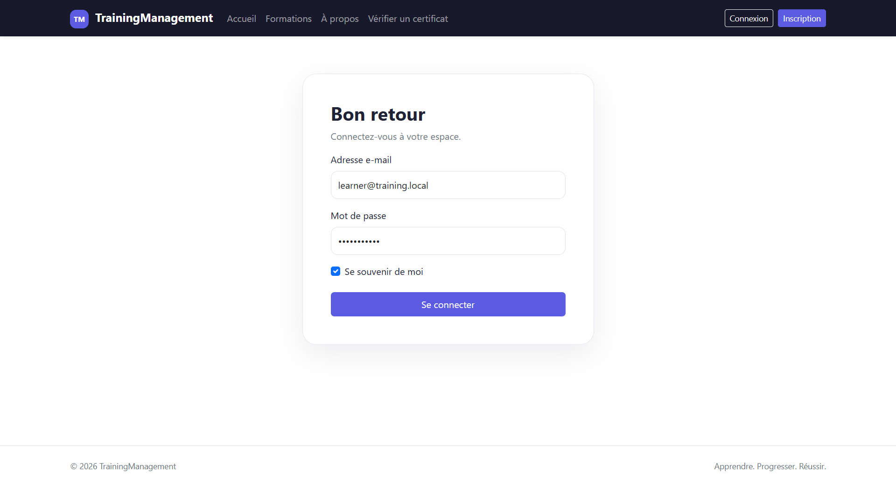
 **Dashboard**
 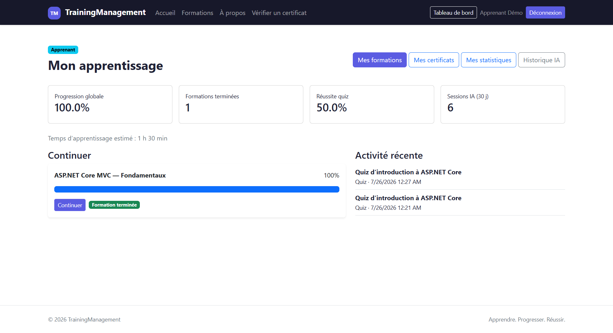
 **Formation**
 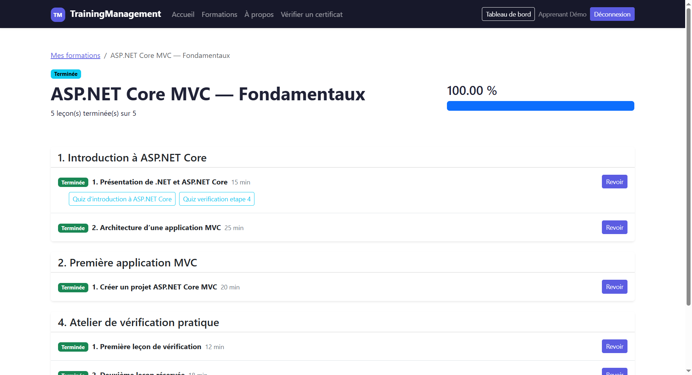
 **Formation details**
 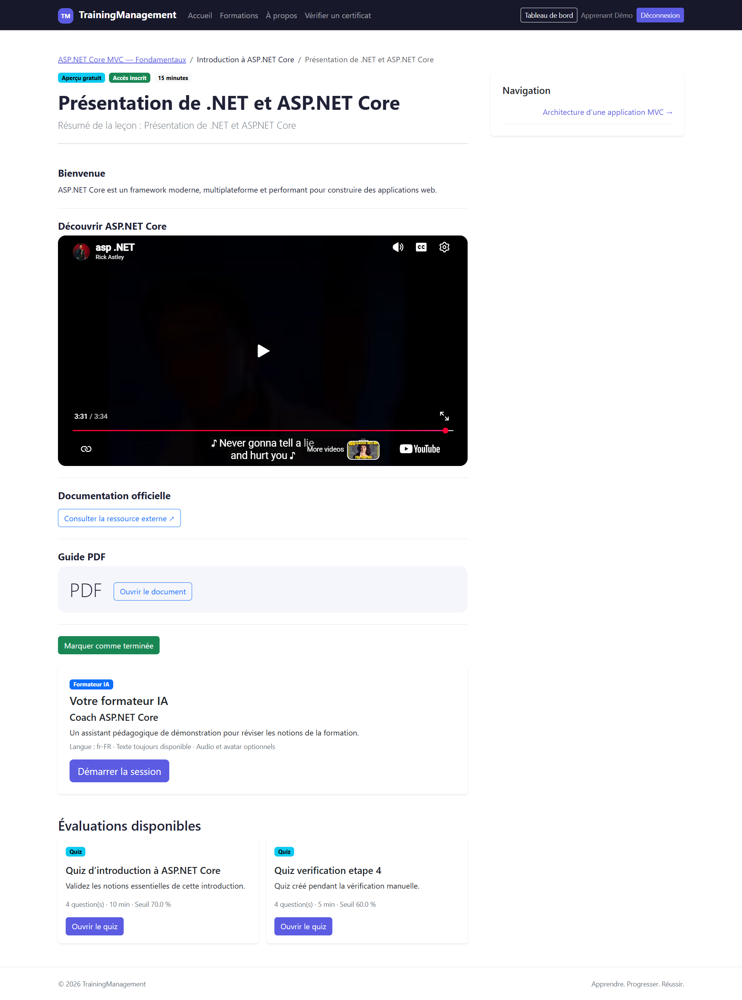
 **Formateur AI**
 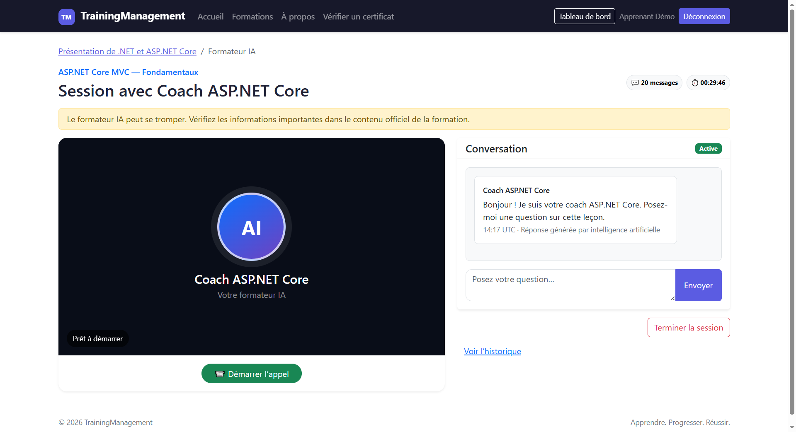
 **Formateur AI Covertation**
 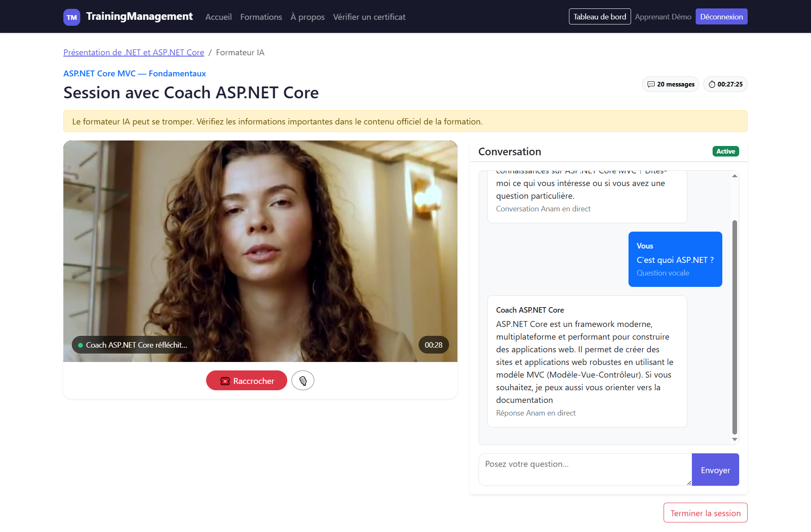
 **Quiz**
 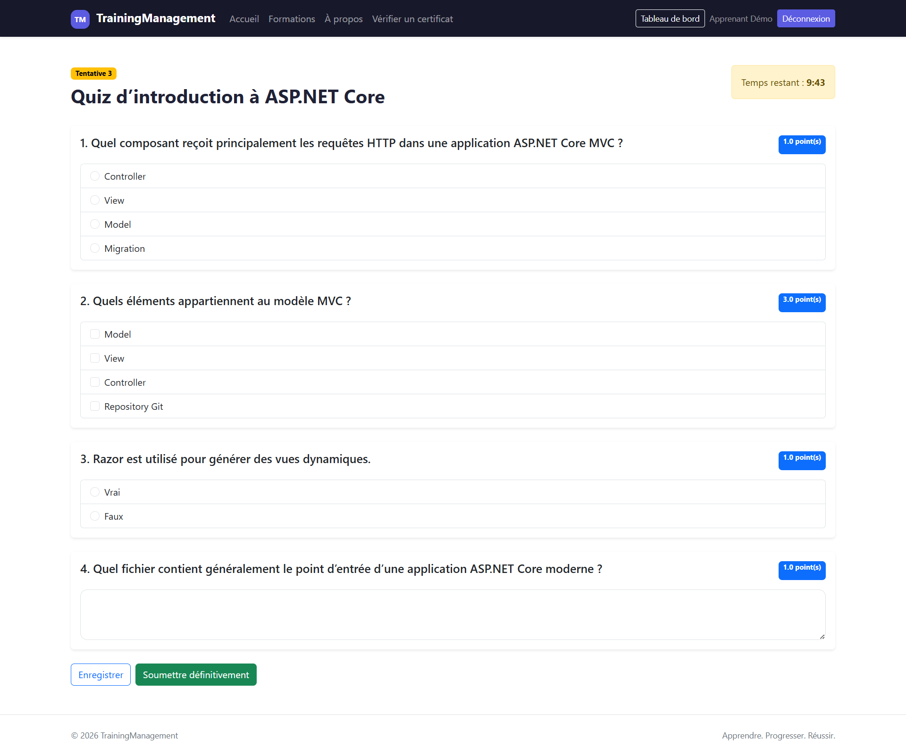
 **Resultat du quiz**
 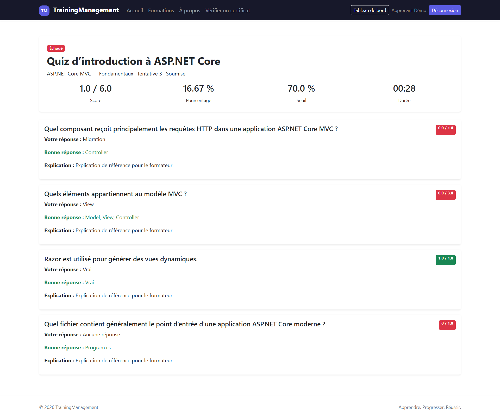
 **admin Dashboard**
 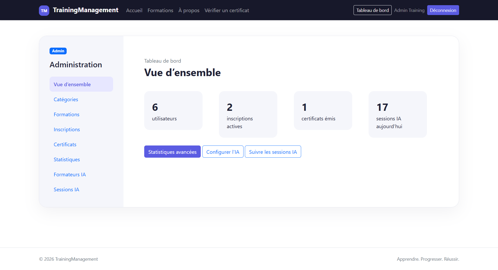
 **Profils de Formateur Ai**
 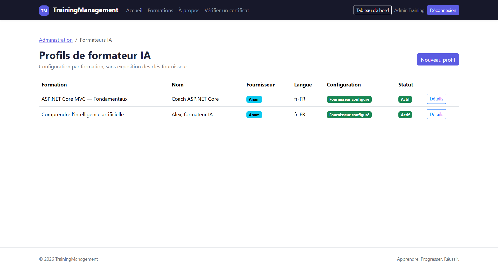
 **Modifier le Profil Ai**
 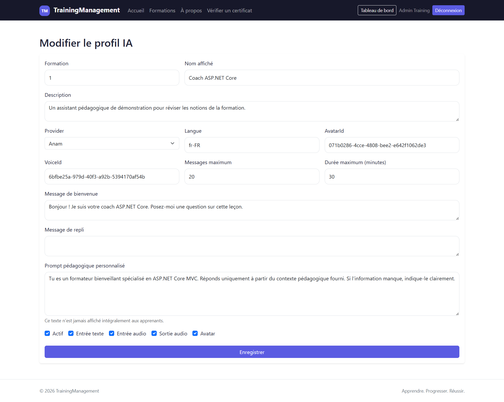
 **Historique de Sessions du formateur AI**
 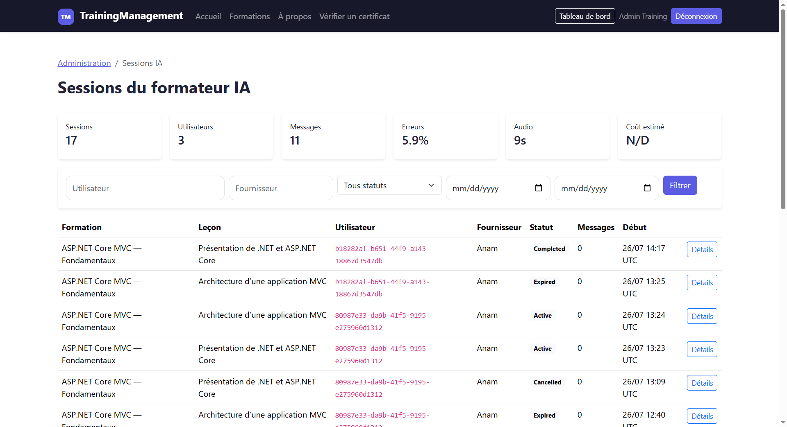

